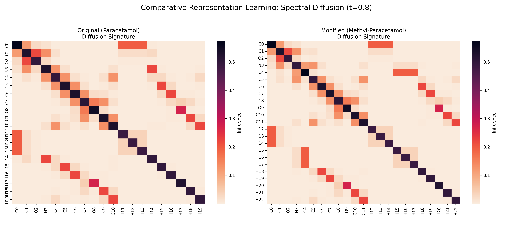

# Chem-Graph-Diffusion
Applying MSc graph diffusion models to chemical representation learning and lead optimization
# Spectral Representation Learning for Molecular Graphs

This repository demonstrates the application of graph-theoretic methods developed during my MSc (COMP702: *Graph Diffusion for Quantifying Network Similarity*) to chemical discovery and representation learning.

## Objective
To adapt the Heat Kernel ($e^{-tL}$) of normalized Graph Laplacians into a fixed-length representation (embedding) of chemical structures, providing a mathematically rigorous foundation for **Human-Guided Representation Learning**.

## Incremental Learning & Structural Perturbation
The script computes and visualizes the diffusion signatures of molecules. Below is a demonstration of how the model captures structural perturbations, a critical feature for tracking lead optimization.
By comparing the diffusion kernels of Paracetamol and its methylated derivative, we can observe how the 'influence' of the Nitrogen center is redistributed across the aromatic ring. This spectral shift serves as a feature for Human-in-the-loop steering, where a chemist identifies which structural influences are critical for the desired chemical property

*Figure 1: Spectral Diffusion Signatures. Comparing Paracetamol to its methylated derivative demonstrates how the 'influence' of the Nitrogen center is redistributed. This spectral shift serves as a feature for human-in-the-loop steering, allowing a chemist to prioritize specific structural influences.*

## Technical Stack
* **RDKit:** Chemical informatics and SMILES-to-graph conversion.
* **NetworkX:** Spectral graph theory and normalized Laplacian computation.
* **SciPy / Matplotlib:** Matrix exponentiation (Heat Kernel) and visualization.
